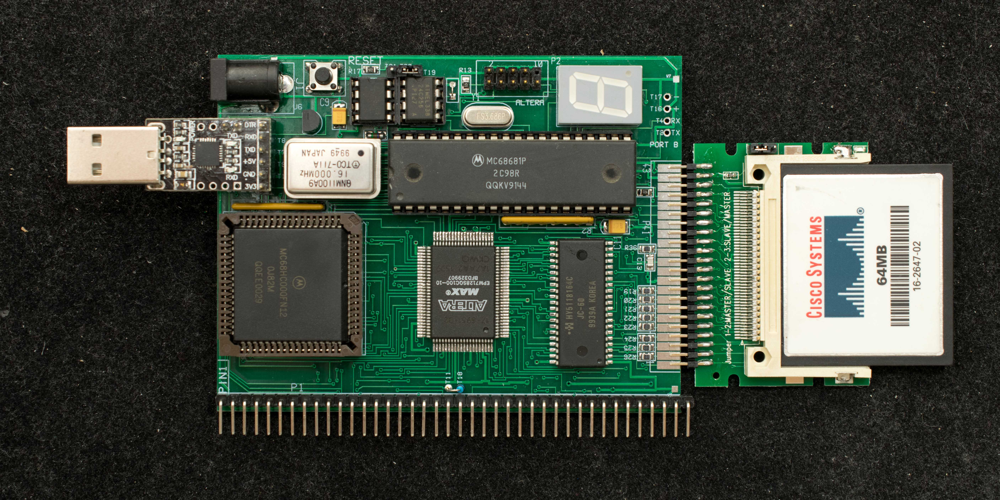

# T68KRC, Rev0.1 
## Introduction

T68KRC derived from version 1 of Tiny68K. The major differences are Instead of 16 meg of memory, T68KRC has 2 meg of memory, and an expansion bus that's compatible with RC2014's I/O module is added. Like Tiny68K, T68KRC has no parallel ROM. The boot ROM is a 32Kbyte serial flash that's copied into the lowest 32Kbyte of the memory when powered up or with a reset. The RAM-resident boot software can be modified just like any data in RAM but is overwritten on the next power cycle or with a reset.

Figure below shows an assembled T68KRC Rev0.1.

## Features

- Motorola 68000 CPU
- MC68681 DUART, port A is the console operating at 38400 baud, 8N1, with CTS/RTS hardware handshake.
- Altera EPM7128 CPLD contains the glue logic:
  - State machine to load 32K serial flash when powered up or with a reset,
  - DRAM controller for the 2-megabyte DRAM,
  - Hidden CAS-before-RAS refresh in hardware, no software overhead required,
  - memory decoder,
  - Interrupt controller,
  - Bus Error watchdog timer,
- 8-16 MHz oscillator (only 8 MHz operation is tested)
- 32Kbyte serial flash, 24C256 as the boot device.
- Second 32K serial flash that can be programmed in-situ and serves as the alternate boot device with just one jumper change.
- 44-pin edge connector interfaces to a low-cost IDE-CF module
- HY5118164 1Mx16 DRAM
- I/O expansion port compatible with RC2014 I/O bus interface.
- 7-segment LED display as visual indicator of board operations.
- Target for CP/M-68K ver 1.3
- 100mm x 76mm 2-layer pc board

## Descriptions

This is a basic 68000 single board computer with one unusual feature. The boot ROM is stored in an low-cost 256kbit serial EEPROM, 24C256. At power up or when reset button is pressed, the content of the serial EEPROM is copied into the low address of DRAM while 68000 is held in reset. When the copying operation is completed, the 68000 nRESET is released and it boots from the code in EEPROM. The design motivation is cost saving because serial EEPROM is significantly cheaper than two ROM devices; 2 meg DRAM is cheaper than the equivalent SRAM and the programmable logic required to load serial EEPROM and interface to DRAM is a low-cost, medium complexity CPLD which is needed in any case for a traditional design. Because the serial EEPROM is a small 8-pin device and the 1meg x 16 DRAM is in space-saving 44-pin SOJ package, the resulting circuit board is smaller, thus at lower cost, . The theory of operation is described in greater details below.

The CPLD is an Altera EPM7128SQC100 that contains both the serial EEPROM loader as well as the DRAM controller. To copy the content of the serial EEPROM to DRAM, there are a number of distinct operations:
1. The serial EEPROM's internal address counter needs to be initialized to zero. This is done with a “Dummy Write” command where a 3-byte command consists of START-EEPROM Address-Low address-High address is sent serially to the EEPROM.
2. After the serial EEPROM's address counter is initialized to zero, a “Sequential Read” command is issued followed by continuous byte reads of the EEPROM. The serial EEPROM's internal address counter will automatically increment to next address for every byte read.
3. The serial EEPROM loader state machine is a large counter chain consists of a 15-bit byte counter for 32K bytes of data, a bit counters for 8-bit data plus 1-bit acknowledge, and a clock divider to divide down the internal 8MHz master clock to 500KHz serial clock. The 15-bit byte counter also serves as the address generator for the DRAM address such that the 3 most significant bits are presented during the RAS cycle and the 11 lower bits are presented during the CAS cycle. The least significant bit of the 15-bit byte counter determines the Odd/Even bytes, so it is not used for DRAM addressing.
4. Because 68000's data bus is 16-bit wide, the main memory is a 1meg X 16 DRAM. The serial data from the EEPROM is shifted into a 16-bit data register. During the acknowledge cycle of the serial EEPROM read operation, the 16-bit data in the shift register along with 14 bit of address from the 15-bit byte counter (the least significant 15th address bit is the Odd/Even byte of a 16-bit word and not used) are used to drive the DRAM controller and write data into DRAM.
5. The serial clock rate is 500KHz or 2uS per bit and there are 9 bit per byte (8 data bit plus acknowledge), so it takes close to 600mS to copy the content of the 256k-bit flash into DRAM. Therefore the DRAM refresh logic must be operating during the copying operation. The refresh operation is CAS-before-RAS and runs in the background once every 128 master clocks (one refresh per 16uS).
6. At the end of the copying operation, the content of the serial EEPROM will reside in the lowest 32K bytes of DRAM. The base address of DRAM is at 0x0 so upon the negation of 68000 nRESET at the end of the copying operation, the 68000 will fetch valid data in DRAM just copied from the serial EEPROM.

The software development environment for the serial EEPROM is as followed:
- EASy68K is the 68000 assembler which generates S-Record as its output.
- EASyBIN converts the S-Record to binary format
- a USB-based serial EEPROM programmer, CH341A, reads in the binary data and programs a serial EEPROM. This serial EEPROM becomes the boot device

### Memory map

- RAM is from 0x0 to 0x1FFFFF,
- Serial Flash is from 0xFFD000-0xFFDFFF
- IDE-CF is from 0xFFE000-0xFFEFFF
- 68681 DUART is from 0xFFF000-0xFFFFFF
- RC2014 expansion bus is from 0xFF8000-0xFF8FFF. 2 wait states access ← verify this

## Design Files <- Need extensive updates

* Rev 0.1 [schematic](t68krc_r01_scm.pdf)
* Rev 0.1 [Gerber photoplots](t68krc_rev0_1_gerber.zip)
* [CPLD design files](t68krc_rev0_1_cpld_design_files.zip) Altera EPM7128 design files Designs are created in Quartus 8.1, should be compatible with later version of Quartus. Designs are entirely in schematics.
  - Schematic in PDF format.
  - CPLD Programming binary in .pof format.
* Part list

### Software
- T68KRC [Monitor debugger](software/t68krc_rev01_software_debugger_v0_0.zip). The software is developed in the EASy68K tool chain. Programming binary for serial EEPROM programmer (CH341).
- [Clear CP/M memory](software/t68krc_rev01_software_clrcpmmem.zip) area. This small utility prepare the memory space where CP/M BIOS/CCP/BDOS will reside. Its use is explain in the procedure for creating new CF disk.
- [T68KRC BIOS](software/t68krc_rev01_software_t68kbios_r1.zip), updated 8/11/19 with correct TPA size.
- [CP/M-68K v1.3](software/cpm68k_cpm15000.zip) located starting from 0x15000
- CP/M-68K v1.3 distribution [disk image for T68KRC RAMdrive](software/t68krc_rev01_software_ram_disk_image_srecord.zip)
- Utility
  - Memory diagnostics
  - Clear CP/M memory area

### Connect to a PC

A PC with terminal program such as Hyperterminal is needed to interface with Tiny68K. An USB-to-serial adapter with TTL level input/output can connect directly to T68KRC's console connector. For USB-to-serial adapter with RS232 I/O, an adapter board is needed.
- [RS232 adapter board](console_rs232_interface.pdf) to interface to the DB9 serial connector of a PC. The RS232 adapter is not needed for most USB-to-serial adapters which have TTL level I/O.
### Powering up T68KRC

Apply 5V to the board via the 2.5mm power jack, the center is 5V, barrel is ground. The nominal power consumption at 8MHz system clock is 500mA. When powered is applied, the 7-segment LED will display '8' for a second and then '6'. While waiting for console command, the outer segments of the 7-segment display will flash for 1/2 second, one segment at a time, in a circular sequence. If the display indicate a static '4', it is waiting for hardware handshake signal to assert. Be sure the terminal program has RTS/CTS hardware handshake enabled.
### Creating a [new CF disk](create_new_CF_disk.md)
